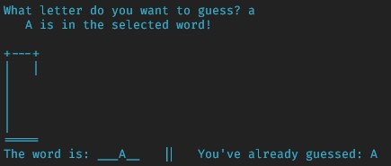

# py-hangman

Simple command line hangman game built while learning Python.

## Game In Action
Upon starting the game, a word is randomly selected. Users are prompted to guess a letter in the word.

The game reveals correct guesses in the word and tracks letters that have already been guessed

Upon an incorrect guess, part of the hangman is drawn

If the player makes 6 incorrect guesses, the game is over

